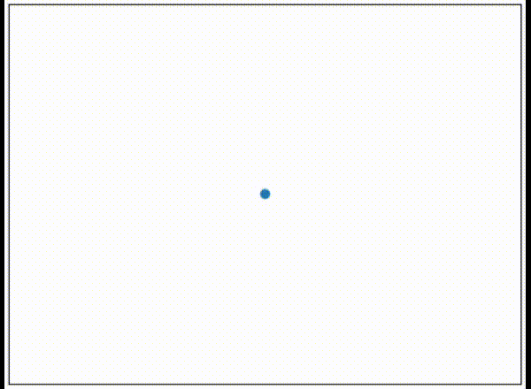
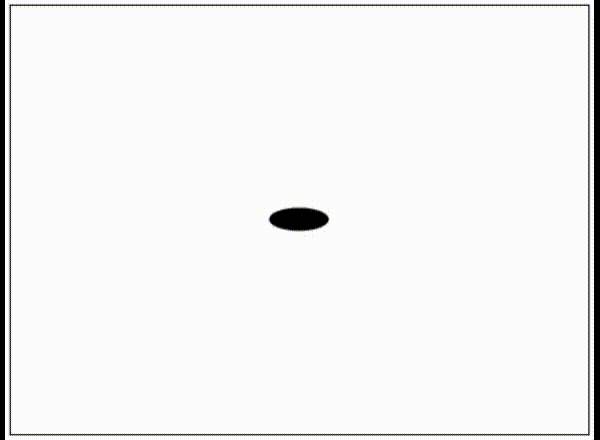
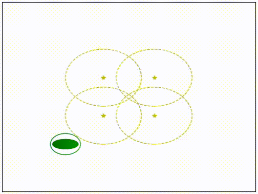

# dymoesco - Dynamics Modeling, Estimation and Control

[](https://github.com/samlaf/dymoesco/actions?query=workflow%3A%22Python+application%22)
[](https://codecov.io/gh/samlaf/dymoesco)
[](https://dymoesco.readthedocs.io/en/latest/?badge=latest)

dymoesco is my attempt at building a general purpose robotics library to speed up the testing of simple new ideas. It is also great as a teaching platform. [Drake](https://drake.mit.edu/) should be used for any serious project. But for prototyping or testing quick ideas, its API can feel inflexible and overly complicated. dymoesco also has matplotlib plotting and animations, which when a full-fledged rendering engine is not needed, makes for nice and easy gif generation. In a nutshell, dymoesco is to Drake what [turtle](https://docs.python.org/3/library/turtle.html) is to [unity](https://unity.com/).

### Installation

dymoesco revolves around three subpackages: `estimation`, `control`, and `dynamics`. There are other helper modules such as `dymoesco.utils` and `dymoesco.types`.
Installing dymoesco works just like any other package

```shell
git clone https://github.com/samlaf/dymoesco.git
pip install -r requirements.txt .
```

### Docs
Sphinx documentation is found in the /docs directory.


### Examples

With the general framework developed in this library, it is easy to extend it with simple dynamical systems, mapping the arrow keys to inputs and driving using matplotlib as gui.

#### Simple Dynamical Systems

<link href="style.css" rel="stylesheet"></link>
<div class="row">
  <div class="column">
	<center><b> Single Integrator </b></center>
	
  </div>
  <div class="column">
	<center><b> Double Integrator </b></center>
	
  </div>
  <div class="column">
	<center><b> Differential Drive </b></center>
	
  </div>
</div>


#### Range/Bearing EKF on a differential drive model

My general impetus for developing this library was to understand range/beacon EKFs better.




